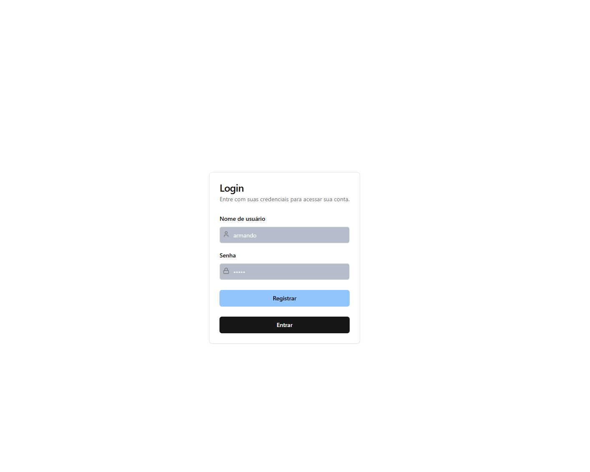
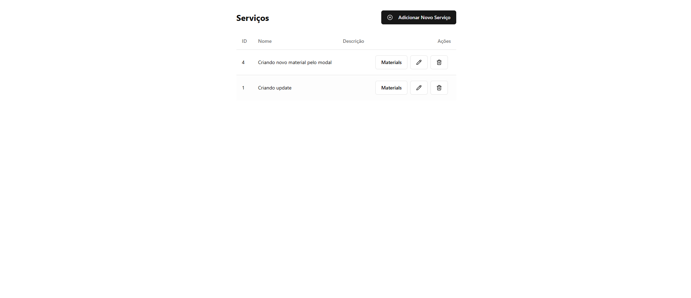
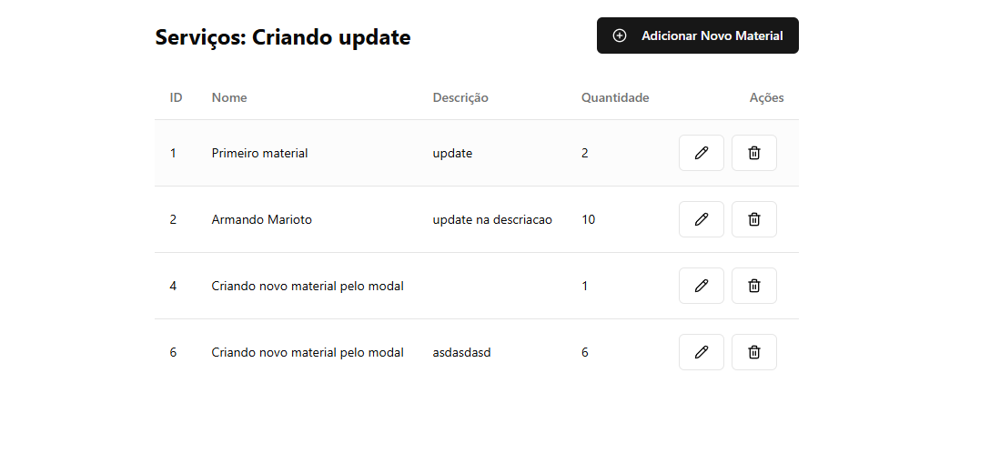

## Description

Descrição
Este projeto consiste em uma aplicação completa com NestJS no back-end e React no front-end. A aplicação permite o gerenciamento de serviços e materiais, oferecendo operações de CRUD e autenticação via JWT. Todos os serviços estão dockerizados para facilitar a execução e orquestração com Kubernetes (via Podman).

Tecnologias Utilizadas
Back-end: NestJS, TypeORM, SQL Server, JWT
Front-end: React, TypeScript, CSS Less
Containerização: Docker e Podman (Kubernetes)
Banco de Dados: SQL Server


## Pré-requisitos

Antes de iniciar, certifique-se de que os seguintes programas estão instalados no seu ambiente:

Docker (recomendado para gerenciar os contêineres)
Podman (alternativa ao Docker para orquestração via Kubernetes)
Você pode instalar o Docker seguindo as instruções oficiais: Docker Documentation.
Se preferir o Podman, siga as instruções oficiais: Podman Documentation.

## Instalação

## Passo 1: Clone o repositório:

```bash
$ git clone <URL_DO_REPOSITORIO>
$ cd <NOME_DO_PROJETO>
```

## Passo 2: Copiando as envs de exemplo

## backend
```bash
$ cd back
$ cp .env.example .env
```
Defina as variáveis de ambiente caso nao queira a usar as de exemplo.


## frontend
```bash
$ cd ..
$ cd frontend
$ cp .env.example .env
```
Defina as variáveis de ambiente caso nao queira a usar as de exemplo.

## Passo 3: Executando

Volte para a pasta raiz do projeto

```bash
$ cd ..
```

Execute o Docker Compose para inicializar os contêineres:
```bash

$ docker compose up --build -d 
OU
$ podman compose up --build -d 

```

## Passo 4: Acessar a Aplicação
Back-end (NestJS): Acesse http://localhost:3000.
Front-end (React): Acesse http://localhost:5173.

## Endpoints da API
## Autenticação
POST /auth/register: Registrar um login.
POST /auth/login: Realiza login e retorna um JWT.
## Serviços
POST /services: Cria um novo serviço.
GET /services: Lista todos os serviços.
PUT /services/:id: Atualiza um serviço existente.
DELETE /services/:id: Deleta um serviço.
##  Materiais
POST /services/:serviceId/materials: Cria um novo material para um serviço.
GET /services/:serviceId/materials: Lista materiais de um serviço.
PUT /services/:serviceId/materials/:materialId: Atualiza um material.
DELETE /services/:serviceId/materials/:materialId: Deleta um material.


## Passo 5: Orquestração com Podman e Kubernetes (Opcional)
Para executar a aplicação utilizando Kubernetes com Podman:

Ainda na raiz do projeto rode:
```bash

$ podman kube play labtrans-complete.yaml

```

## Passo 6: Encerrando a Aplicação

Para encerrar a aplicação e remover os contêineres, utilize o comando:

```bash
$ docker-compose down
```

Para o Podman, primeiro identifique o nome do pod:

```bash
$ podman pod ps
```

Em seguida, remova o pod com:

```bash
$ podman pod rm -f <NOME_DO_POD>
```

Tela de login:


Tela de listagem de servicos:


Tela de listagem de materiais:



## Erros Possíveis e Soluções

1. Migration Não Executada Automaticamente
Se as migrations não rodarem automaticamente na primeira execução, você pode rodá-las manualmente com o comando abaixo:

Acesse o contêiner do back-end:

```bash
$ docker compose exec backend bash
$ npm run migration:run
$ exit
```

2. Contêiner do Back-end Não Inicia
Se o contêiner do back-end falhar ao iniciar, ele pode ter parado devido a algum erro de conexão com o banco de dados ou configuração. Para reiniciá-lo:

Verifique o status dos contêineres:

```bash
$ docker-compose ps
$ docker-compose restart backend
```
Dica: Você também pode verificar os logs para obter mais detalhes sobre o erro:
```bash
$ docker-compose logs backend
```


3. Banco de Dados Não Conecta
Caso o erro seja de conexão com o banco de dados:

Verifique se as variáveis de ambiente no arquivo .env estão configuradas corretamente.
Certifique-se de que o contêiner do banco de dados (SQL Server) está em execução e escutando na porta correta (geralmente 1433 para SQL Server):
```bash
$ docker-compose up -d db
```

## 4. Erro: 

`/usr/bin/env: 'bash\r': No such file or directory`

Este erro ocorre quando o script tem quebras de linha no formato Windows (CRLF) ao invés de Unix (LF). Isso pode acontecer se o script for editado em um editor no Windows.

#### Solução:
- Se você estiver no Windows, abra o arquivo no **Notepad++** ou **VS Code** e salve-o com quebras de linha no formato **LF**.
- **No Notepad++**:
  - Vá em **Editar** -> **Converter quebras de linha para** -> **Unix (LF)**.
  - Salve o arquivo.
- **No VS Code**:
  - No canto inferior direito, clique onde diz **CRLF** e selecione **LF**.
  - Salve o arquivo.
- Alternativamente, no terminal, você pode usar `dos2unix` ou `sed` para remover o caractere de quebra de linha `\r`.

```bash
dos2unix wait-for-it.sh
# ou
sed -i 's/\r//' wait-for-it.sh